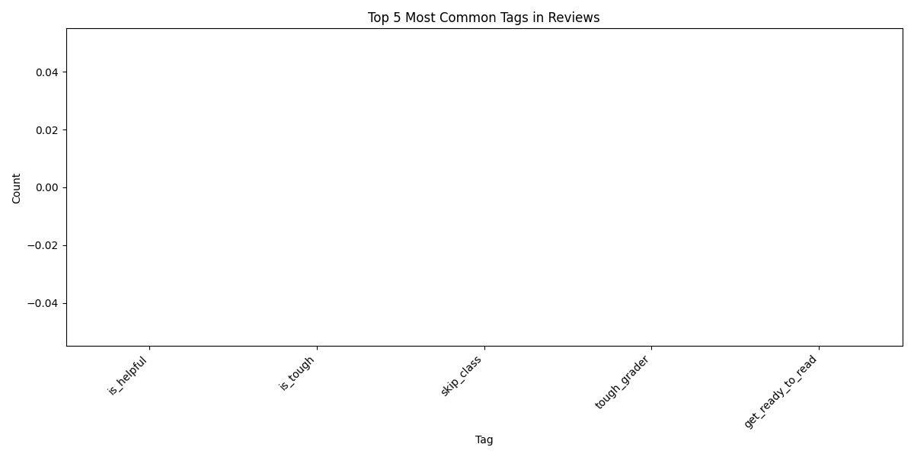
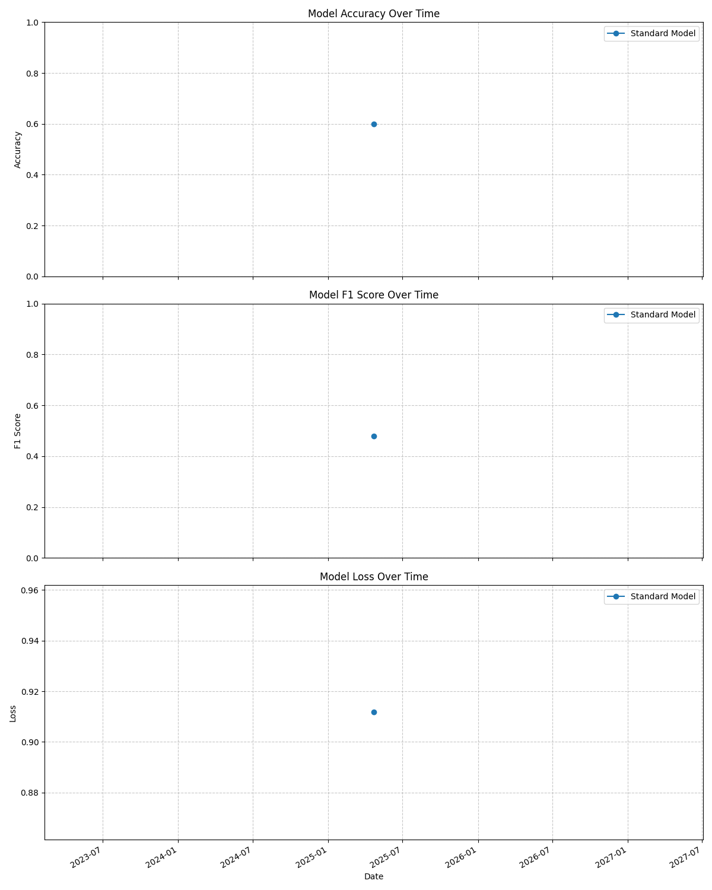

# Penn State Rate My Professors - Review Sentiment Analysis Model (RSAM)

This project scrapes professor reviews from Rate My Professors for Penn State University, processes the data to extract valuable insights, and trains sentiment analysis models to understand student opinions. The project includes data analysis and visualization capabilities, along with model comparison tools to evaluate different sentiment prediction approaches.

## Project Overview

The sentiment analysis pipeline consists of several components that work together:

1. **Web Scraping**: Collects professor reviews from RateMyProfessors.com using the site's embedded data structure
2. **Data Preprocessing**: Cleans and transforms the raw review data, extracting advanced features
3. **Model Training**: Creates two sentiment models:
   - Standard Model: Based on review ratings only
   - Combined Model: Incorporates difficulty ratings and other metadata
4. **Analysis & Visualization**: Generates insights and visualizations about professor reviews
5. **Model Comparison**: Evaluates and compares the performance of both models
6. **Automated Pipeline**: Runs daily to continuously improve the models with new data
7. **Performance Tracking**: Tracks model performance over time with visualizations and reports
8. **Interactive Web Dashboard**: Flask-based UI for exploring data and visualization results

## Features

- **Enhanced Data Collection**: Scrapes not just review text and ratings, but also difficulty scores, tags, and "would take again" information
- **Dynamic Tag Extraction**: Automatically extracts professor's top tags from their profile pages
- **Randomized Professor Selection**: Avoids repetition of professors in scraping cycles
- **Nuanced Sentiment Analysis**: Creates a combined score that balances rating with difficulty
- **Tag Analysis**: Extracts meaningful features from review tags (helpful, tough, caring, etc.)
- **Department Analysis**: Identifies sentiment patterns across different academic departments
- **Model Comparison**: Analyzes where and why the standard and combined models differ in predictions
- **Performance Tracking**: Visual tracking of model metrics over time to measure continuous improvement
- **Automated Learning**: Daily scheduled runs to continuously improve model accuracy

## Architecture

### Data Collection & Processing Stack
- **Web Scraping System**
  - Custom Rate My Professors scraper
  - Randomized professor selection algorithm
  - Automated data acquisition pipeline
  - Dynamic tag extraction from professor profiles

- **Data Processing Pipeline**
  - Text cleaning and normalization
  - Feature extraction from reviews
  - Sentiment classification preprocessing
  - Department and professor categorization
  - NaN value handling and data integrity checks

### Machine Learning Pipeline
- **Model Training Framework**
  - Standard Model: Rating-based sentiment classification
  - Combined Model: Multi-feature sentiment analysis
  - Training/test data splitting and validation
  - Performance metrics tracking

- **Analysis & Comparison Tools**
  - Statistical analysis of sentiment patterns
  - Department-level comparisons
  - Tag frequency and correlation analysis
  - Model performance visualization
  - Longitudinal tracking of model improvements

### Frontend Stack
- **Flask Web Application**
  - Jinja2 templating engine
  - Bootstrap 5 UI framework
  - Responsive dashboard design
  - Interactive data filtering

- **Visualization System**
  - Plotly.js for interactive charts
  - Dynamic chart generation
  - Customizable visualization parameters
  - Real-time data filtering capabilities

### Backend Architecture
- **Flask API Endpoints**
  - Data retrieval and filtering routes
  - Chart generation endpoints
  - Professor and department listing services
  - Error handling and logging

- **Data Management**
  - Pandas DataFrames for data manipulation
  - CSV-based data persistence
  - Efficient filtering and aggregation
  - JSON serialization with NaN handling

### Automation & Scheduling
- **Pipeline Automation**
  - APScheduler for task scheduling
  - Daily data collection and processing
  - Incremental model training
  - Performance tracking and reporting

## Technology Stack & Libraries

This project leverages a comprehensive set of Python libraries and frameworks for its various components:

### Machine Learning & NLP Libraries
- **PyTorch**: Core deep learning framework used for model training and inference
  - Used for creating neural network architectures and computing gradients
  - Provides GPU acceleration for faster model training when available
  - Handles tensors and computational graphs for the sentiment models

- **Transformers (Hugging Face)**: Advanced NLP model library
  - Provides pre-trained DistilBERT model for fine-tuning on professor reviews
  - Implements tokenizers for processing text data
  - Offers sequence classification models for sentiment analysis
  - Includes optimization schedulers for training efficiency

- **Scikit-learn**: Machine learning utilities
  - Used for performance metrics calculation (accuracy, F1-score)
  - Provides classification reports for model evaluation
  - Handles train/test splits and evaluation metrics
  - Implements data preprocessing functionality

### Data Processing & Analysis
- **Pandas**: Data manipulation and analysis
  - Core data structure for storing and processing review data
  - Handles CSV reading/writing and DataFrame operations
  - Provides filtering, grouping, and aggregation capabilities
  - Manages NaN values and data integrity

- **NumPy**: Numerical computing
  - Supports efficient array operations for model inputs/outputs
  - Provides mathematical functions for data analysis
  - Handles statistical calculations for metrics
  - Works with pandas for data transformations

- **Matplotlib & Seaborn**: Data visualization
  - Creates performance tracking visualizations
  - Generates training progress plots with loss and accuracy curves
  - Produces department analysis charts and sentiment distributions
  - Visualizes tag frequency and correlation analyses

### Web Scraping & Automation
- **Requests**: HTTP client for web scraping
  - Fetches professor review pages from Rate My Professors
  - Handles HTTP sessions and response processing
  - Manages request headers and parameters

- **BeautifulSoup4**: HTML parsing for web scraping
  - Extracts review content, ratings, and metadata
  - Parses professor profile pages for additional information
  - Navigates DOM structure to locate relevant data

- **APScheduler**: Task scheduling
  - Implements automated daily runs of the data pipeline
  - Manages periodic scraping, processing, and model retraining
  - Provides cron-like scheduling capabilities
  - Ensures consistent data collection over time

### Web Application & Visualization
- **Flask**: Web application framework
  - Serves the interactive dashboard interface
  - Provides API endpoints for data retrieval and processing
  - Implements routing and request handling
  - Renders Jinja2 templates for the frontend

- **Plotly**: Interactive visualizations
  - Powers the customizable interactive charts in the web UI
  - Provides bar charts, scatter plots, and heatmaps
  - Enables user-driven data exploration
  - Supports dynamic filtering and aggregation in visualizations

- **Bootstrap 5**: Frontend framework
  - Implements responsive dashboard components
  - Provides consistent styling and UI elements
  - Ensures cross-device compatibility
  - Offers interactive components like dropdowns and modals

### Utility & Support Libraries
- **Logging**: Comprehensive logging system
  - Tracks pipeline execution and errors
  - Records model training progress
  - Documents data processing steps
  - Facilitates debugging and performance monitoring

- **TQDM**: Progress visualization
  - Displays progress bars for long-running operations
  - Shows model training progress by epoch and batch
  - Improves user experience during data processing

- **JSON**: Data interchange
  - Handles API responses and data serialization
  - Stores model configurations
  - Manages web application data exchange

## Project Structure

```
📁 ML Project/
├── 📁 data/                  # Stores scraped and processed data
│   ├── 📄 penn_state_reviews_*.csv     # Raw scraped data
│   ├── 📄 *_processed.csv    # Processed review data
│   ├── 📄 train_data.csv     # Training dataset
│   └── 📄 test_data.csv      # Testing dataset
│
├── 📁 models/                # Saved trained models
│   └── 📁 professor_reviews_*_sentiment_*/  # Versioned model folders
│       ├── 📄 config.json    # Model configuration
│       ├── 📄 model.safetensors # Model weights
│       ├── 📄 tokenizer files # Tokenizer configuration
│       └── 📄 vocab.txt      # Model vocabulary
│
├── 📁 logs/                  # Application logs
│   ├── 📄 *_YYYYMMDD.log     # Component-specific logs
│   ├── 📄 standard_test_metrics_*.txt # Model test results
│   └── 📄 training_progress_*.png # Training visualization
│
├── 📁 analysis_plots/        # Generated data visualizations
│   ├── 📄 department_*.png   # Department analysis charts
│   ├── 📄 sentiment_*.png    # Sentiment distribution charts
│   ├── 📄 difficulty_*.png   # Difficulty correlation charts
│   ├── 📄 tag_*.png          # Tag analysis charts
│   └── 📄 would_take_again_*.png # "Would take again" analysis
│
├── 📁 model_comparison_plots/# Model comparison analysis
│
├── 📁 performance_tracking/  # Performance metrics over time
│   ├── 📄 accuracy_*.png     # Accuracy trend visualizations
│   ├── 📄 f1_*.png           # F1 score trend visualizations
│   ├── 📄 loss_*.png         # Loss trend visualizations
│   ├── 📄 combined_metrics_*.png # Multi-metric visualizations
│   ├── 📄 model_performance_history.csv # Historical performance data
│   └── 📄 model_performance_report.md # Performance summary
│
├── 📁 screenshots/           # UI screenshots for documentation
│   ├── 📄 dashboard.png      # Dashboard overview screenshot
│   ├── 📄 ChartEx*.png       # Chart examples
│   └── 📄 data_browser.png   # Data browser screenshot
│
├── 📁 templates/             # Flask application templates
│   ├── 📄 base.html          # Base template with common elements
│   └── 📄 index.html         # Main dashboard template
│
├── 📄 scraper.py             # Rate My Professors web scraper
├── 📄 preprocessor.py        # Data cleaning and feature extraction
├── 📄 model.py               # Sentiment analysis model training
├── 📄 analyze.py             # Data analysis and visualization
├── 📄 compare_models.py      # Model comparison tools
├── 📄 track_model_performance.py # Performance tracking over time
├── 📄 scheduler.py           # Automated pipeline scheduler
├── 📄 app.py                 # Flask web application
├── 📄 main.py                # Main application entry point
└── 📄 requirements.txt       # Project dependencies
```

## Web Application Interface

The project includes an interactive Flask-based web application that provides a user-friendly interface for exploring the sentiment analysis data and visualizations. The web application allows users to:

- View dashboard summary metrics
- Explore interactive charts with customizable parameters
- Browse and filter the review data
- Compare departments and professors

To run the web application:

```
python app.py
```

Then open your browser and navigate to `http://localhost:5000`.

### Dashboard Overview

The dashboard provides a high-level summary of the Penn State RMP data analysis, including key metrics such as total number of reviews, professors analyzed, average ratings, and sentiment distribution. It offers a quick snapshot of the current state of the dataset.


*The dashboard overview shows key metrics including review count, professor count, average ratings, and sentiment distribution. Users can quickly gauge the overall tone of professor reviews across Penn State University.*

### Interactive Charts

The application features a powerful interactive charting system that allows users to create custom visualizations by selecting different variables, chart types, aggregation methods, and filters.


*This chart example shows the average rating by department, broken down by sentiment. Users can customize the x-axis, y-axis, color grouping, chart type, and apply various filters to explore different aspects of the data.*


*This plot demonstrates the relationship between professor ratings and difficulty scores. Each point represents a professor, with colors indicating sentiment categories. This visualization helps identify patterns between perceived difficulty and overall professor ratings.*

### Data Browser

The data browser section allows users to explore the underlying review data directly. Users can filter reviews by department and professor, see the full text of reviews, and analyze individual ratings, difficulties, and sentiments.


*The data browser provides direct access to individual reviews. Users can filter by department and professor to find specific reviews of interest, showing detailed information including the review text, rating, difficulty score, and sentiment classification.*

The web application makes the entire sentiment analysis pipeline accessible to non-technical users, enabling broader engagement with the insights generated from the Rate My Professors data. It serves as both a research tool and a practical utility for students looking to make informed decisions about course selection.

## Key Insights

### Sentiment vs. Difficulty


The analysis reveals that professor difficulty has a substantial impact on sentiment. The combined model weights difficulty appropriately to provide a more balanced view of professor quality.

### Department Comparison


Sentiment varies significantly across departments, with some consistently receiving more positive reviews than others.

### Tag Analysis



The most common tags provide insight into what students value most in their professors, with "helpful" being particularly associated with positive reviews.

### Model Performance Over Time



As more data is collected daily, both models show continuous improvement, with the combined model generally outperforming the standard model. The performance tracking feature helps visualize these trends over time.

## Getting Started

### Prerequisites

- Python 3.8+
- Required Python packages (install via `pip install -r requirements.txt`):
  - requests
  - pandas
  - numpy
  - beautifulsoup4
  - transformers
  - torch
  - scikit-learn
  - matplotlib
  - seaborn
  - apscheduler
  - tqdm
  - regex
  - json
  - logging
  - datetime
  - flask
  - plotly
  - plotly-express

### Installation

1. Clone the repository:
   ```
   git clone <repository-url>
   cd ML Project
   ```

2. Install dependencies:
   ```
   pip install -r requirements.txt
   ```

3. Create required directories:
   ```
   mkdir -p data logs models analysis_plots model_comparison_plots performance_tracking
   ```

### Usage

#### Running the Complete Pipeline

To run the complete pipeline (scrape -> process -> train -> analyze):

```
python main.py --run-all
```

#### Running Individual Components

To run specific parts of the pipeline:

```
python main.py --scrape          # Run just the scraping process
python main.py --process         # Process the most recent scraped data
python main.py --train           # Train on the most recent processed data
```

#### Data Analysis

To analyze the processed data and generate visualizations:

```
python analyze.py
```

This will create visualizations in the `analysis_plots` directory, including:
- Sentiment distribution by difficulty level
- Department rating comparisons
- Tag frequency analysis
- "Would take again" correlations

#### Model Comparison

To compare the standard and combined sentiment models:

```
python compare_models.py
```

This creates comparison reports in the `model_comparison_plots` directory, showing:
- Accuracy comparison between models
- Analysis of cases where models disagree
- Correlation between disagreements and review difficulty

#### Performance Tracking

To track model performance metrics over time:

```
python track_model_performance.py
```

This generates visualizations and reports in the `performance_tracking` directory, showing:
- Model accuracy trends over time
- F1 score progression
- Loss reduction
- Comparative analysis between standard and combined models

#### Scheduled Execution

To set up automated daily runs:

```
python scheduler.py
```

Or to run the scheduler with specific components only:

```
python scheduler.py --scrape-only
python scheduler.py --train-only
python scheduler.py --analyze-only
```

## Future Directions

1. **Multi-Institution Analysis**: Expand to compare professor reviews across multiple universities
2. **Temporal Analysis**: Track how sentiment changes over academic terms
3. **NLP Model Improvements**: Experiment with larger language models for increased accuracy
4. **Interactive Dashboard**: Create a web interface for exploring the data and models
5. **Personalized Recommendations**: Develop a system to recommend professors based on student preferences
6. **Advanced Tag Analysis**: Deeper analysis of tag correlations with sentiment and department

## Recent Updates

- **April 2025**: 
  - Enhanced tag extraction from professor profile pages
  - Added randomization to avoid repeating professors in scrapes
  - Fixed difficulty level ordering in charts for better interpretability
  - Added model performance tracking over time
  - Updated README with comprehensive library documentation

## License

This project is licensed under the MIT License - see the LICENSE file for details.

## Acknowledgments

- Rate My Professors for providing the source data
- Penn State University professors and students who contributed reviews
- The open-source community for the excellent NLP and data science tools
